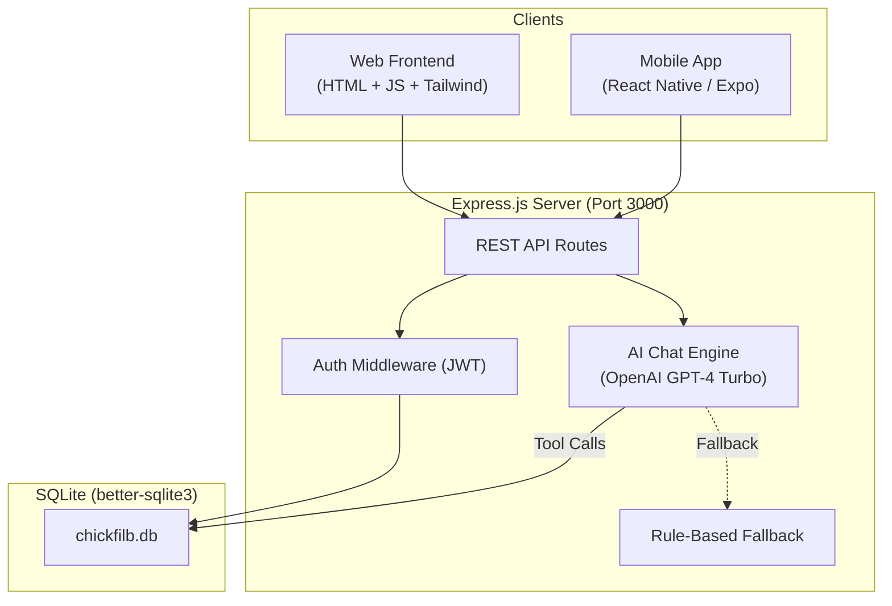
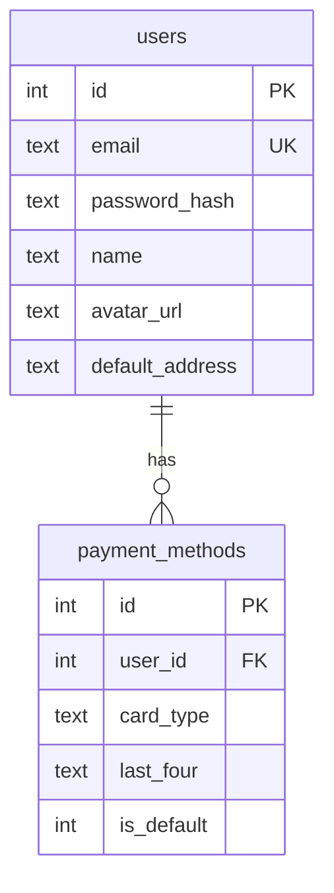
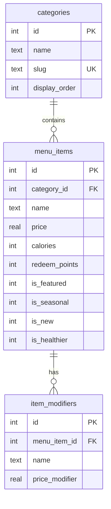
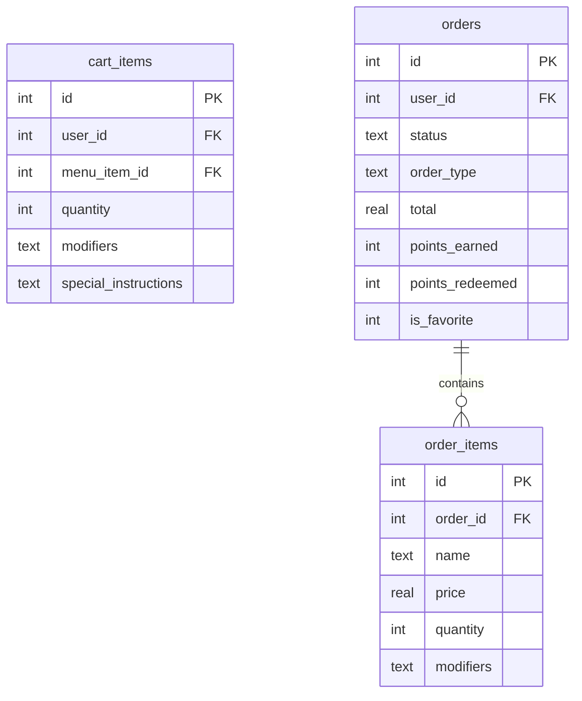

# 🐔 Chick-fil-B — The Intelligent Bistro Viridien

> A full-stack, AI-powered fast-food restaurant ordering platform with a web frontend, React Native mobile app, and an Express.js backend.

**Repository:** [github.com/yuantian94/chickfilB-The-Intelligent-Bistro-Viridien](https://github.com/yuantian94/chickfilB-The-Intelligent-Bistro-Viridien)

---

## Table of Contents

1. [Project Overview](#project-overview)
2. [Architecture](#architecture)
3. [Directory Structure](#directory-structure)
4. [Tech Stack](#tech-stack)
5. [Backend API](#backend-api)
6. [Web Frontend](#web-frontend)
7. [Mobile App](#mobile-app)
8. [AI Chat Assistant (Bessie)](#ai-chat-assistant-bessie)
9. [Database Schema](#database-schema)
10. [Key Features](#key-features)
11. [Getting Started](#getting-started)

---

## Project Overview

Chick-fil-B is a **demo full-stack restaurant ordering application** that simulates a modern fast-food experience across web and mobile platforms. The app features a complete ordering workflow — menu browsing, cart management, checkout, and order tracking — enhanced by an **AI-powered chat assistant** ("Bessie") that can take orders, answer questions, redeem reward points, and reorder past meals via natural language.

The project is organized as a monorepo with three main modules:

| Module | Description | Technology |
|--------|-------------|------------|
| `backend/` | REST API server | Node.js, Express, SQLite |
| `frontend/` | Web SPA | Vanilla HTML/JS, Tailwind CSS |
| `mobile/` | Native mobile app | React Native, Expo (TypeScript) |

---

## Architecture



---

## Directory Structure

```
Chickfilb/
├── backend/                     # Express.js API server
│   ├── server.js                # Entry point — routes, middleware, static serving
│   ├── package.json             # Backend dependencies
│   ├── .env                     # Environment variables (JWT_SECRET, OPENAI_API_KEY)
│   ├── db/
│   │   ├── database.js          # SQLite connection manager (better-sqlite3)
│   │   ├── schema.sql           # Full DDL — 15 tables
│   │   ├── seed.js              # Demo data seeder (users, menu, promos)
│   │   └── seed-modifiers.js    # Item modifier seeder
│   ├── middleware/
│   │   └── auth.js              # JWT authentication middleware
│   └── routes/
│       ├── auth.js              # Register, login, profile, guest migration
│       ├── menu.js              # Menu categories, items, search, featured
│       ├── cart.js              # Authenticated cart CRUD + modifier management
│       ├── orders.js            # Order placement, history, favorites
│       ├── rewards.js           # Reward points, tiers, redeemable items, promos
│       ├── chat.js              # AI chat with OpenAI function-calling
│       └── guest.js             # Guest cart + checkout (token-based)
│
├── frontend/                    # Web SPA (served by Express)
│   ├── index.html               # Shell — bottom nav, chat widget, Tailwind config
│   ├── app.js                   # ~109KB single-file SPA logic (routing, rendering, API)
│   ├── styles.css               # Additional styles
│   ├── index.css                # Base styles
│   └── images/                  # 77 menu item product images (AI-generated PNGs)
│
├── mobile/                      # React Native (Expo) app
│   ├── api.ts                   # Centralized API client (auth + guest headers)
│   ├── app.json                 # Expo configuration
│   ├── package.json             # Mobile dependencies
│   ├── tsconfig.json            # TypeScript config
│   ├── context/
│   │   └── AuthContext.tsx       # Auth state management (login, register, logout)
│   ├── constants/
│   │   └── Colors.ts            # Material Design 3 color tokens
│   ├── app/
│   │   ├── _layout.tsx          # Root layout with AuthProvider
│   │   ├── (tabs)/
│   │   │   ├── _layout.tsx      # Tab navigator (Home, Menu, Rewards, Account)
│   │   │   ├── index.tsx        # Home — featured items, recent orders, rewards card
│   │   │   ├── menu.tsx         # Menu — category tabs, search, grid layout
│   │   │   ├── rewards.tsx      # Rewards — tier progress, redeemable items
│   │   │   └── account.tsx      # Account — login/register, order history, settings
│   │   ├── cart.tsx             # Cart screen with quantity controls, modifiers
│   │   ├── checkout.tsx         # Authenticated checkout (location, payment, promo)
│   │   ├── guest-checkout.tsx   # Guest checkout form
│   │   ├── chat.tsx             # AI chat interface
│   │   ├── customize-item.tsx   # Item customization (modifiers, special instructions)
│   │   ├── order-detail.tsx     # Order detail view + favorite toggle
│   │   └── profile-settings.tsx # Profile editor (address, payment card)
│   ├── components/              # Shared UI components
│   └── assets/                  # Icons, splash screen, fonts
│
├── .gitignore                   # Excludes node_modules, .env, *.sqlite, test scripts
└── database.sqlite              # (gitignored) Runtime database
```

---

## Tech Stack

### Backend
| Component | Technology |
|-----------|-----------|
| Runtime | **Node.js** |
| Framework | **Express.js 4** |
| Database | **SQLite** via `better-sqlite3` (synchronous, high-performance) |
| Auth | **JWT** (`jsonwebtoken`) + **bcryptjs** for password hashing |
| AI | **OpenAI GPT-4 Turbo** with function-calling (tool use) |
| UUID | `uuid` for guest token generation |

### Web Frontend
| Component | Technology |
|-----------|-----------|
| Framework | Vanilla **HTML5 / JavaScript** (single-page app) |
| Styling | **Tailwind CSS** (CDN) with Material Design 3 color system |
| Typography | **Plus Jakarta Sans** (Google Fonts) |
| Icons | **Material Symbols Outlined** |
| Animations | CSS keyframe animations (`slideUp`, `fadeIn`) |

### Mobile
| Component | Technology |
|-----------|-----------|
| Framework | **React Native 0.81** + **Expo SDK 54** |
| Language | **TypeScript** |
| Navigation | **Expo Router 6** (file-based routing) |
| Storage | **expo-secure-store** (encrypted token storage) |
| State | React Context API |
| UI | Custom `StyleSheet` + Material Design 3 colors |

---

## Backend API

### Authentication (`/api/auth`)

| Endpoint | Method | Auth | Description |
|----------|--------|------|-------------|
| `/api/auth/register` | POST | — | Register new user, auto-migrate guest orders |
| `/api/auth/login` | POST | — | Login, returns JWT |
| `/api/auth/me` | GET | JWT | Get current user profile + rewards + payment methods |
| `/api/auth/me` | PUT | JWT | Update default address / payment method |

### Menu (`/api/menu`)

| Endpoint | Method | Auth | Description |
|----------|--------|------|-------------|
| `/api/menu` | GET | — | List all menu items (supports `?category=`, `?search=`, `?featured=`) |
| `/api/menu/categories` | GET | — | List all categories |
| `/api/menu/:id` | GET | — | Get single item with modifiers |

### Cart (`/api/cart`)

| Endpoint | Method | Auth | Description |
|----------|--------|------|-------------|
| `/api/cart` | GET | JWT | Get cart with subtotal, discount, tax, total |
| `/api/cart` | POST | JWT | Add item (auto-merges duplicates) |
| `/api/cart/:id` | PUT | JWT | Update item quantity |
| `/api/cart/:id/modifiers` | PUT | JWT | Update modifiers with quantity-split support |
| `/api/cart/:id` | DELETE | JWT | Remove item |
| `/api/cart` | DELETE | JWT | Clear entire cart |

### Orders (`/api/orders`)

| Endpoint | Method | Auth | Description |
|----------|--------|------|-------------|
| `/api/orders` | POST | JWT | Place order (applies promos, tier discounts, earns/redeems points) |
| `/api/orders` | GET | JWT | Get full order history with items |
| `/api/orders/:id` | GET | JWT | Get single order detail |
| `/api/orders/:id/favorite` | POST | JWT | Toggle favorite order |

### Rewards (`/api/rewards`)

| Endpoint | Method | Auth | Description |
|----------|--------|------|-------------|
| `/api/rewards` | GET | JWT | Get points, tier, and progress to next tier |
| `/api/rewards/redeemable` | GET | JWT | List items redeemable with points |
| `/api/rewards/promotions` | GET | — | Get active promotions |

### Chat (`/api/chat`)

| Endpoint | Method | Auth | Description |
|----------|--------|------|-------------|
| `/api/chat` | POST | JWT | Send message, get AI response (creates session if needed) |
| `/api/chat/history` | GET | JWT | Get past chat sessions + messages |

### Guest (`/api/guest`)

| Endpoint | Method | Auth | Description |
|----------|--------|------|-------------|
| `/api/guest/cart` | GET | Guest Token | Get guest cart |
| `/api/guest/cart` | POST | Guest Token | Add to guest cart |
| `/api/guest/cart/:id` | PUT | Guest Token | Update guest cart item |
| `/api/guest/cart` | DELETE | Guest Token | Clear guest cart |
| `/api/guest/checkout` | POST | Guest Token | Place guest order (email required) |

---

## Web Frontend

The web frontend is a **single-page application** rendered entirely in `app.js` (~109KB). It features:

- **SPA Router**: Hash-based navigation across views (Home, Menu, Rewards, Account, Cart, Checkout, Item Detail, Order Detail)
- **Material Design 3 Color System**: Complete MD3 token system via Tailwind config
- **Bottom Navigation Bar**: Fixed nav with Home, Menu, Rewards, Account tabs
- **Chat Widget**: Floating "Bessie" AI chat overlay accessible from any page
- **Toast Notifications**: Animated toast system for feedback messages
- **Responsive Design**: Mobile-first with desktop breakpoints
- **Guest Mode**: Full browsing and cart management without authentication

---

## Mobile App

The Expo/React Native mobile app provides a native experience with:

### Tab Screens
| Tab | Screen | Features |
|-----|--------|----------|
| 🏠 Home | `(tabs)/index.tsx` | Greeting, rewards progress card, recent orders carousel, featured items |
| 🍽️ Menu | `(tabs)/menu.tsx` | Category filter tabs, search bar, grid layout, quick add-to-cart |
| 🎁 Rewards | `(tabs)/rewards.tsx` | Tier progress visualization, redeemable items list, point balances |
| 👤 Account | `(tabs)/account.tsx` | Login/Register forms, order history, profile settings link, logout |

### Modal/Stack Screens
| Screen | File | Features |
|--------|------|----------|
| Cart | `cart.tsx` | Item list with quantity +/– buttons, modifier display, subtotal/discount/tax/total breakdown |
| Checkout | `checkout.tsx` | Pickup/Delivery toggle, location picker, payment method, promo code, save-as-favorite |
| Guest Checkout | `guest-checkout.tsx` | Email, card details form, location for unauthenticated users |
| AI Chat | `chat.tsx` | Full chat interface with Bessie AI assistant |
| Customize Item | `customize-item.tsx` | Toggle modifiers, special instructions, quantity selector |
| Order Detail | `order-detail.tsx` | Full order breakdown, reorder button, favorite toggle |
| Profile Settings | `profile-settings.tsx` | Edit default address and payment method |

### Key Mobile Architecture
- **Centralized API Layer** (`api.ts`): All 25+ API functions with automatic auth/guest header injection
- **AuthContext**: Global state for user, cart count, points tracking; auto-refreshes on mount
- **Secure Storage**: JWT tokens stored in `expo-secure-store` (encrypted on device)
- **Image Resolution**: `resolveImageUrl()` function converts relative `/images/...` paths to full server URLs

---

## AI Chat Assistant (Bessie)

Bessie is the app's intelligent assistant, powered by **OpenAI GPT-4 Turbo** with **function calling** (tool use). She has access to 6 tools:

### Available Tools

| Tool | Description |
|------|-------------|
| `add_to_cart` | Add a menu item to the user's cart with optional modifiers |
| `redeem_item_with_points` | Redeem a menu item using reward points |
| `update_item_modifiers` | Change modifiers on existing cart items (supports partial quantity modification) |
| `update_item_quantity` | Change quantity of a cart item or remove it entirely |
| `clear_cart` | Remove all items from the cart |
| `remove_all_redeem_items` | Remove only reward-redeemed items from the cart |

### Context Awareness
Each message to the AI includes rich, real-time context:
- **Full menu** with prices, calories, redeem points, and affordability calculations
- **Current cart contents** with modifiers and cart item IDs
- **User profile**: name, tier, total points, and **true available balance** (accounting for points reserved by items already in cart)
- **Favorite order** with per-item reorder plan (REDEEM vs REGULAR based on available points)
- **Recent order history** (last 3 orders) with intelligent reorder support

### Fallback System
If OpenAI is unavailable (no API key or API error), Bessie gracefully falls back to a **rule-based response engine** that handles common queries about recommendations, nutrition, rewards, promotions, and more.

---

## Database Schema

The app uses **SQLite** with **15 tables** across 4 domains:

### Users & Auth


### Menu System


### Orders & Cart


### Guest System
- `guest_cart_items` — Cart items keyed by `guest_token` UUID
- `guest_orders` — Orders keyed by email, auto-evicted after 24 hours
- `guest_order_items` — Order line items for guest orders

### Other Tables
- `rewards` — Points, tier, total earned (per user)
- `promotions` — Active promo codes (percent/fixed discount)
- `chat_sessions` & `chat_messages` — Full chat history persistence

---

## Key Features

### 🛒 Ordering System
- Browse 50+ menu items across 9 categories (Chicken Entrees, Meals, Sides, Salads, Kid's Meals, Treats, Beverages, Breakfast, Sauces)
- Item customization with modifiers (No Pickle, Extra Spicy, etc.)
- Smart cart merging: identical items with same modifiers auto-consolidate
- Modifier quantity splitting: modify only _some_ of a multi-quantity item

### 🎁 Rewards & Loyalty
- **4-tier system**: Member → Silver (1K pts) → Gold (3K pts) → Platinum (5K pts)
- Tier-based discounts: 0% / 2% / 3% / 5% off all orders
- Earn 10 points per dollar spent
- Redeem points for free menu items (each item has a specific point cost)
- Points "reservation" system: points are tracked when redeem items are in cart

### 🤖 AI-Powered Chat
- Natural language ordering via OpenAI GPT-4 Turbo
- Function-calling for cart mutations (add, redeem, update, remove)
- Contextual awareness of menu, cart, user profile, and order history
- Intelligent favorite order reordering with point-budget planning
- Graceful rule-based fallback when AI is unavailable

### 👤 Guest Checkout
- Browse and add to cart without authentication
- Persistent guest token stored securely on device
- Complete checkout with email and card details
- **Order migration on registration**: guest orders placed with the same email are automatically migrated to the new account with points retroactively awarded
- 24-hour auto-eviction of old guest data

### ⭐ Favorite Orders
- Mark any order as your favorite
- One-tap reorder from order history or via Bessie
- AI handles complex reorder logic: items originally redeemed with points get re-evaluated against current point balance

### 💳 Checkout
- Pickup vs Delivery toggle
- Address management with saved default
- Payment method selection (demo fake cards)
- Promo code application (WELCOME15, FRYFRIDAY, SAVE3)
- Real-time subtotal, tier discount, tax, and total calculation

### 📱 Cross-Platform
- Web SPA served by the same Express server
- Native mobile experience via Expo/React Native
- Shared backend API with consistent behavior
- Platform-adaptive secure storage (SecureStore vs localStorage)

---

## Getting Started

### Prerequisites
- Node.js 18+
- npm
- (For mobile) Expo CLI, iOS Simulator or Android Emulator

### 1. Backend
```bash
cd backend
cp .env.example .env     # Add JWT_SECRET and optional OPENAI_API_KEY
npm install
npm run seed             # Seed the database
npm start                # Starts on http://localhost:3000
```

**Demo credentials:** `demo@chickfilb.com` / `password123`

### 2. Web Frontend
The web frontend is automatically served by Express at `http://localhost:3000`.

### 3. Mobile App
```bash
cd mobile
npm install
npx expo start           # Opens Expo dev tools
```
Press `i` for iOS Simulator or `a` for Android Emulator.

> [!NOTE]
> The mobile app expects the backend at `http://localhost:3000`. If running on a physical device, update `SERVER_ROOT` in `mobile/api.ts` to your machine's local IP.

---

## Seed Data Summary

| Data | Count |
|------|-------|
| Demo Users | 2 (Jordan Smith + Alex New) |
| Menu Categories | 9 |
| Menu Items | 50+ |
| Product Images | 77 (AI-generated) |
| Promotions | 3 |
| Initial Reward Points | 1,250 (Jordan, Silver tier) |
